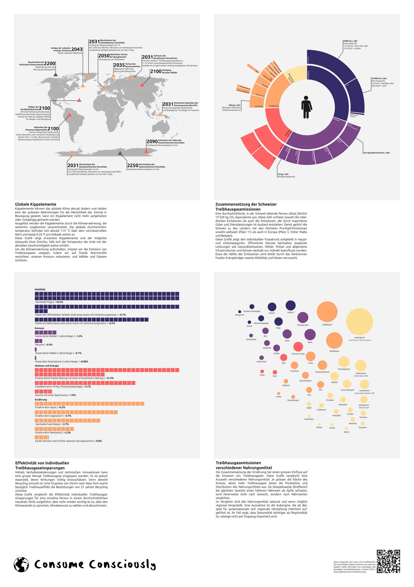

Der Klimawandel ist heute eine der grössten globalen Herausforderungen.
Wir müssen die Emission von Treibhausgasen innert wenigen Jahrzehnten drastisch eindämmen um uns und kommenden Generationen fatale ökologische und wirtschaftliche Konsequenzen zu ersparen.

Um ein solch komplexes Problem zu lösen braucht es zum einen die notwendige Motivation, zum anderen aber auch das Wissen, welche Massnahmen auch wirklich effektiv sind.
_Consume Consciously_ ist ein Projekt mit dem Ziel, sowohl die Problematik des Klimawandels als auch individuelle Massnahmen aufzuzeigen.

Die Lizenz befindet sich [hier](LICENSE).

## Infografik

Die Infografik ist in folgenden Formaten verfügbar:

* [PDF](poster/poster.pdf)
* [Vektorgrafik (.svg)](poster/poster.svg)
* [Bild (.png)](poster/poster.png)

## Quellen

Alle Grafiken basieren auf frei verfügbaren Daten.

Die Grafiken "Zusammensetzung der Schweizer Treibhausgasemissionen", "Effektivität von individuellen Treibhausgaseinsparungen" und "Treibhausgasemissionen verschiedener Nahrungsmittel" werden auf [dieser Webseite](https://co2nscious.web.app/) zu Testzwecken grob gerendert.

Im Folgenden sind alle Datenquellen, und gegebenenfalls Links zum Quellcode für die Grafiken aufgeführt.

### Globale Kippelemente

* [Global Tipping Points](https://global-tipping-points.org/resources-gtp/)
* [Greenpeace](https://www.greenpeace.org.uk/challenges/climate-change/solutions-climate-change/)
* [Wikipedia](https://en.wikipedia.org/wiki/Tipping_points_in_the_climate_system)
* [Carbonbrief](https://www.carbonbrief.org/explainer-nine-tipping-points-that-could-be-triggered-by-climate-change/)
* [Global Tipping Points - Report 2023](https://report-2023.global-tipping-points.org/section2/2-tipping-point-impacts/2-2-assessing-impacts-of-earth-system-tipping-points-on-human-societies/2-2-5-potential-for-earth-system-tipping-points-to-magnify-or-accelerate-impacts-of-global-warming/)
* [Our World in Data](https://ourworldindata.org/grapher/consumption-co2-per-capita-equity?tab=table&time=2022)
* [Climate Change Tracker](https://climatechangetracker.org/igcc)
* [TED Talk](https://www.youtube.com/watch?v=Vl6VhCAeEfQ) (verlinkt weitere Quellen in Präsentation)
* [World Map](https://en.m.wikipedia.org/wiki/File:BlankMap-World.svg)

### Zusammensetzung der Schweizer Treibhausgasemissionen

Die [Grafik](src/app/components/footprint-sunburst/chart.component.ts) basiert auf folgenden [Daten](src/app/data/Data.ts):

* Bundesamt für Statistik [(1)](https://www.bfs.admin.ch/bfs/de/home/statistiken/bevoelkerung.assetdetail.32374798.html), [(2)](https://www.bfs.admin.ch/news/de/2022-0544), [(3)](https://www.bfs.admin.ch/bfs/de/home/statistiken/mobilitaet-verkehr/unfaelle-umweltauswirkungen/umweltauswirkungen.html)
* [Bundesamt für Umwelt](https://www.bafu.admin.ch/bafu/de/home/themen/klima/zustand/daten/co2-statistik.html)
* [Bundesamt für Raumentwicklung](https://www.are.admin.ch/dam/are/de/dokumente/verkehr/dokumente/mikrozensus/verkehrsverhalten-der-bevolkerung-2015.pdf.download.pdf/Verkehrsverhalten%20der%20Bev%C3%B6lkerung%202015.pdf)
* [Parlament](https://www.parlament.ch/de/ratsbetrieb/suche-curia-vista/geschaeft?AffairId=20214259)
* WWF [(1)](https://www.wwf.ch/de/nachhaltig-leben/footprintrechner), [(2)](https://www.wwf.ch/de/nachhaltig-leben/mein-fussabdruck-mobilitaet)
* [Swissrecycle](https://swissrecycle.ch/de/wertstoffe-wissen/leistungsbericht-2023/kennzahlen)
* [Tages-Anzeiger](https://www.tagesanzeiger.ch/altkleider-sammlung-nur-wenig-kleider-werden-recycelt-529856152838)
* [Global E-waste](https://api.globalewaste.org/publications/file/297/Global-E-waste-Monitor-2024.pdf)
* [Person Icon](https://uxwing.com/genderqueer-genderless-person-icon/)

### Effektivität von individuellen Treibhausgaseinsparungen

Die [Grafik](src/app/components/savings/savings-chart.component.ts) basiert auf einigen Daten aus "Zusammensetzung der Schweizer Treibhausgasemissionen" und folgenden zusätzliche Daten:

* [Greenpeace](https://www.greenpeace.ch/static/planet4-switzerland-stateless/2022/03/20967b15-infras_zusammenfassung-laengere-nutzungsdauer_de_20220322.pdf)
* [Houzy](https://www.houzy.ch/post/co2-emissionen-von-heizungen)
* [Dusche fürs Klima](https://duschbrause-co2.ch/fileadmin/ihs_bilder_grafiken/infografik_einsparungen_haushalt.jpg)
* [Swissolar](https://www.swissolar.ch/01_wissen/swissolar-publikationen/branchen-faktenblatt_pv_ch_d.pdf)
* [Solarenergie](https://www.solarenergie.de/photovoltaikanlage/finanzielles/lohnt-sich-photovoltaik/photovoltaik-im-winter)

### Treibhausgasemissionen verschiedener Nahrungsmittel

Die [Grafik](src/app/components/nutrition-ayce/chart.component.ts) basiert auf folgenden [Daten](src/app/data/NutritionAyce.ts):

* [Eaternity](https://foodforfuturefreiburg.de/wp-content/uploads/2022/04/Eaternity-All-you-can-eat.pdf)

### Andere

* [Weltkugel Icon](https://www.svgrepo.com/svg/137733/world)
* Schriftarten [(1)](https://www.fontspace.com/joe-as-font-f26151), [(2)](https://design.ubuntu.com/font)
* [QR-Code](https://www.qrcode-monkey.com/)

## Website development

This project was generated with [Angular CLI](https://github.com/angular/angular-cli) version 17.3.0.

### Development server

Run `ng serve` for a dev server. Navigate to `http://localhost:4200/`. The application will automatically reload if you change any of the source files.

### Code scaffolding

Run `ng generate component component-name` to generate a new component. You can also use `ng generate directive|pipe|service|class|guard|interface|enum|module`.

### Build

Run `ng build` to build the project. The build artifacts will be stored in the `dist/` directory.

### Running unit tests

Run `ng test` to execute the unit tests via [Karma](https://karma-runner.github.io).

### Running end-to-end tests

Run `ng e2e` to execute the end-to-end tests via a platform of your choice. To use this command, you need to first add a package that implements end-to-end testing capabilities.

### Further help

To get more help on the Angular CLI use `ng help` or go check out the [Angular CLI Overview and Command Reference](https://angular.io/cli) page.
